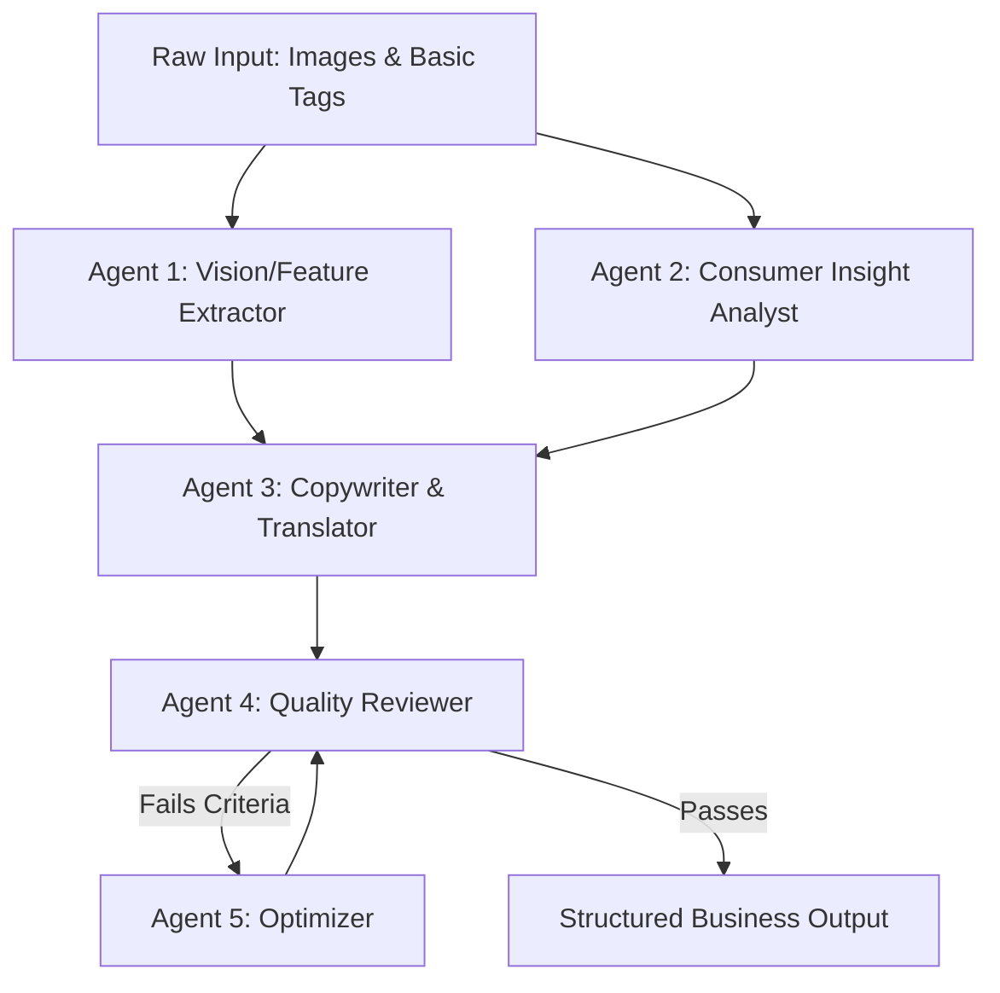

# Designing Multi-Agent Workflows

## Overview

Multi-Agent Workflows transform AI from a simple text generation tool into a specialized virtual team. Instead of relying on a single complex prompt, break the task down into discrete agents (Vision, Psychology, Copywriting, Review, Optimization), each with a specific role and constrained input/output. This pattern is particularly powerful for turning low-quality inputs (like raw images and basic tags) into high-value, structured business assets (like complete e-commerce product pages).

## When to Use

- When a single LLM call produces generic, "AI-sounding" text or fails to follow complex formatting rules.
- When the task requires distinct cognitive shifts (e.g., extracting physical facts vs. understanding emotional needs).
- When you need a self-correcting loop (generation -> review -> refinement) before presenting the result to the user.
- When the input is multimodal (images + text) but the output needs strict text structuring.

## The Core Concept: Forced Perspective Shift

The secret to a successful multi-agent workflow for marketing/e-commerce is enforcing a strict perspective shift from the **Brand's Perspective** (features/parameters) to the **Consumer's Perspective** (benefits/solutions).

| Dimension     | ❌ Brand Perspective (Input)           | ✅ Consumer Perspective (Agent Output)          |
| :------------ | :------------------------------------- | :---------------------------------------------- |
| **Focus**     | "Self-indulgent" selling points        | Practical buying reasons                        |
| **Core Goal** | Listing product features               | Solving user pain points                        |
| **Language**  | Technical specs (e.g., 700 fill power) | Tangible benefits (e.g., warm without the bulk) |

## Standard Agent Pipeline (The 5-Agent Model)

When building a generative pipeline for complex content (like the Apparel Detail Page Generator), structure it as a sequential and iterative flow:

### 1. Vision & Feature Extractor (Agent 1)

- **Role:** The "Eyes".
- **Prompt Focus:** "Act as a physically descriptive machine. Look at these images and list the objective physical attributes (color, layout, material hints, specific design elements like pockets or zippers). Do not write marketing copy."
- **Input:** Images + Product Name.
- **Output:** A dry, factual list of features.

### 2. Consumer Insight Analyst (Agent 2)

- **Role:** The "Psychologist".
- **Prompt Focus:** "Given this target audience tag, answer four questions: 1) Who is the decision maker vs. user? 2) What are their daily usage scenarios? 3) What are their deepest pain points regarding this product category? 4) What ultimate value will make them buy?"
- **Input:** Target Audience Tags.
- **Output:** A psychological profile and scenario map.

### 3. Copywriter & Translator (Agent 3 - The Core)

- **Role:** The "Brain".
- **Prompt Focus:** "Take the physical features from Agent 1 and the pain points from Agent 2. Perform a 'Dimensionality Reduction Translation'. Never use raw technical specs. Follow this formula: `[Visual Feature/Spec] + [Pain Point Solved] + [Tangible Benefit]`. Create specific, colloquial selling points."
- **Input:** Output from Agent 1 & Agent 2.
- **Output:** Draft marketing copy and structural recommendations.

### 4. Quality Reviewer (Agent 4)

- **Role:** The "Director".
- **Prompt Focus:** "Act as a cynical e-commerce director. Review the draft against these criteria: 1) Does it sound like AI? 2) Are there any raw technical specs left untranslated? 3) Does it directly address the pain points? If it fails, specify exactly why."
- **Input:** Draft from Agent 3.
- **Output:** Pass/Fail flag and specific critique.

### 5. Optimizer (Agent 5)

- **Role:** The "Fixer".
- **Prompt Focus:** "Take the original draft and the Director's critique. Rewrite only the sections that failed, addressing the specific feedback."
- **Input:** Draft + Critique.
- **Output:** Revised draft (sent back to Agent 4).

## Structured Output Formatting

Do not end the pipeline with a wall of text. The final output must be structured as actionable SOPs (Standard Operating Procedures) for downstream teams:

1.  **For Copywriters:** Structured buying points with catchy titles.
2.  **For Operations:** Segmented usage scenarios.
3.  **For Designers:** A table recommending main image concepts (e.g., Image 1: Lifestyle context, Image 2: Feature macro shot).
4.  **For Customer Service:** Pre-generated "Buyer Reviews" matching different personas and an FAQ addressing likely objections.

## Common Mistakes

- **Merging Agents:** Trying to make one prompt do vision extraction, psychological profiling, and copywriting simultaneously. This leads to generic, hallucinated, or uninspired text.
- **Skipping the Review Loop:** Accept that the first generation (Agent 3) will often be flawed. The Agent 4 -> Agent 5 loop is what creates the illusion of high intelligence.
- **Allowing Technical Jargon:** Failing to explicitly forbid the LLM from regurgitating the input specs verbatim in the final copy.
